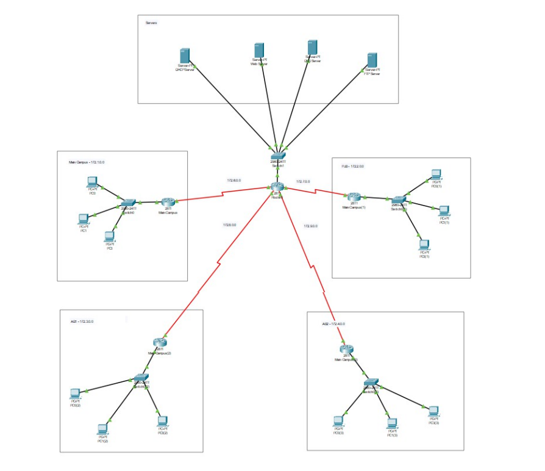

# East-West-University-Network
Made by: Tasnim Jabir
East West University, operates a multi-campus environment with a wide range of academic and administrative facilities. Its network infrastructure must support thousands of users across different campuses with reliable wired and wireless connectivity, centralized services, and scalability for future growth.
This project focuses on designing a complete network model using Cisco Packet Tracer, Integrating SMTP & POP3 (Email Configuration), FTP Configuration, Routing Configuration, Web Server HTTP, and DHCP to achieve seamless connectivity across our campuses.
  
